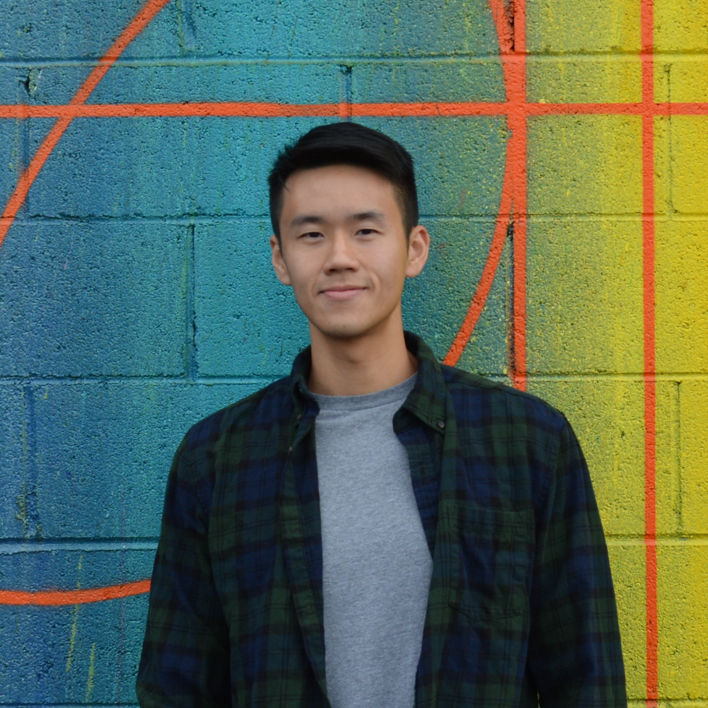

* * *

## About Me

{:height="350px" width="350px"}{: style="float: right"} 

My name is Benson Truong and I'm from San Gabriel, California. I am currently a graduate student at UC Santa Barbara pursuing a Master of Environmental Science & Management degree. In this program, I plan to specialize in Conservation Planning with a focus in Environmental Data Science. I am interested in ecological restoration, especially dealing invasive species. My ideal job is to perform a mix of field work and data analyses. [Download CV](./cv.pdf).

* * *

## My coding projects

1. [Description of the project](./benson_lab_2_trial.html).

2. [Description of the project](./assignment2_task2_bt.html).

3. [Description of the project](./benson_lab_2_trial.html).

4. [Description of the project](./assignment2_task2_bt.html).

* * *

## Skills:

*   R & RStudio
*   GitHub
*   ArcGIS
*   Adobe Premiere Pro
*   Photoshop

* * *

**Contact Information:**

truongbenson96@gmail.com | (626) 221-2854| [Linkdin](https://www.linkedin.com/in/benson-truong-580570122/)

[Link to another page](./another-page.html).

